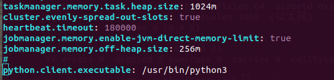

# pyflink_stream_learning
pyflink dataStream api学习
pyflink 只支持python3

**1.** 创建虚拟环境 <br>
因为集群运行时，需要将运行环境打包，使用虚拟化环境，可以控制环境大小<br>
   * 安装虚拟环境的第三方包 virtualenv
   ```
    pip install virtualenv
   ```
   * 创建虚拟环境 <br>
   cd 到存放虚拟环境光的地址<br>
   ```
   virtualenv env 在当前目录下创建名为env的虚拟环境（如果第三方包virtualenv安装在python3下面，此时创建的虚拟环境就是基于python3的）
   virtualenv -p /usr/local/bin/python3 env2 参数 -p 指定python版本创建虚拟环境
   virtualenv --system-site-packages env 参数 --system-site-packages 指定创建虚拟环境时继承系统三方库
   ```
   * 激活/退出虚拟环境
   ```
   source env/bin/activate 激活虚拟环境
   deactivate 退出虚拟环境
   ```
   * 删除虚拟环境 <br>
   直接删除虚拟环境所在目录即可 <br>
   
   其他虚拟环境创建参考博客 https://www.cnblogs.com/shyern/p/11284127.html
   
**2.** pyflink 安装 <br>
安装包较大，建议使用国内镜像安装
```
pip install apache-flink==1.12.0
```

**3.** 打包环境 <br>

```
zip -r venv.zip venv

```

**4.** 运行
   * 本地运行，直接运行文件即可
   * 集群运行 <br>
   4.1 可以将jar文件直接放入 ~/flink-1.12.1/lib 目录下,代码中不要再添加jar文件,不然会出现任务一直提交卡死，提交不成功<br>
   4.2 如果集群python 软链接指向 python2 可以修改软软链接指向python3 也可在flink 客户端修改配置文件 flink-conf.yaml <br>
   python.client.executable: /usr/bin/python3<pyton3 地址>
    <br>
    4.3 如有多个py文件，在py文件目录执行提交命令<br>
    ```
    /home/Documents/flink12/flink-1.12.1/bin/flink run  -py kafka_to_kafka.py
    ```
    还可以通过 -m 参数<集群master节点> 直接提交至集群
    ```
    /home/Documents/flink12/flink-1.12.1/bin/flink run  -m 192.168.172.112:8081 -py kafka_to_kafka.py
    ```